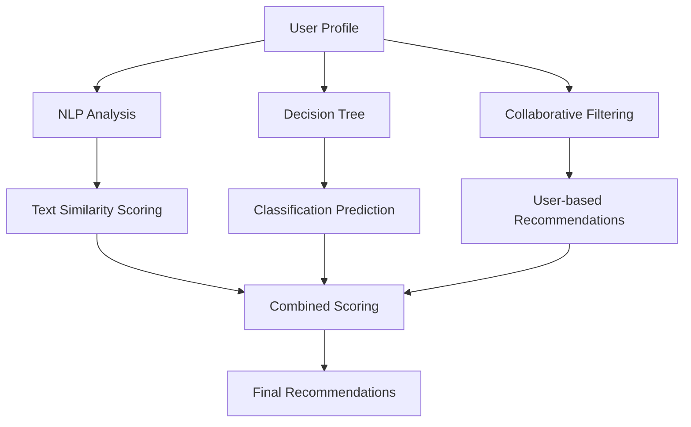

# MY NEW CAREER
## AI-Powered Career Recommendation System


**MY NEW CAREER** is an intelligent career recommendation system that uses advanced AI algorithms including Natural Language Processing (NLP), Decision Trees, and Collaborative Filtering to help students and professionals discover their ideal career paths.

## 🎯 Features

- **🧠 Multi-Algorithm AI**: Combines NLP, Decision Trees, and Collaborative Filtering
- **📊 Comprehensive Analysis**: Skill gap analysis, career growth insights, salary expectations
- **🎨 Interactive Interface**: Modern Streamlit web application with intuitive design
- **📈 Data Visualization**: Rich charts and analytics for career exploration
- **🔍 Career Explorer**: Browse careers by industry, growth outlook, and requirements
- **💡 Personalized Recommendations**: Tailored suggestions with detailed explanations
- **📱 Responsive Design**: Works on desktop and mobile devices

## 🚀 Quick Start

### Prerequisites

- Python 3.8 or higher
- pip package manager

### Installation

1. **Clone or download the project**:
   ```bash
   git clone <repository-url>
   cd "career recmmendation systemm"
   ```

2. **Install dependencies**:
   ```bash
   pip install -r requirements.txt
   ```

3. **Download NLTK data**:
   ```bash
   python -c "import nltk; nltk.download('punkt_tab'); nltk.download('punkt'); nltk.download('stopwords'); nltk.download('vader_lexicon'); nltk.download('wordnet')"
   ```

4. **Run the application**:
   ```bash
   streamlit run app.py
   ```

5. **Open your browser** and navigate to `http://localhost:8501`

## 📁 Project Structure

```
career recommendation systemm/
├── app.py                          # Main Streamlit application
├── requirements.txt                # Python dependencies
├── test_system.py                  # System testing script
├── README.md                      # This file
├── data/                          # Dataset files
│   ├── student_profiles.csv       # Student profile data
│   ├── career_database.csv        # Career information database
│   └── user_ratings.csv           # User ratings for careers
├── src/                           # Source code modules
│   ├── data_preprocessing.py      # Data preprocessing pipeline
│   ├── nlp_processor.py          # Natural Language Processing
│   ├── decision_tree_model.py    # Decision Tree classifier
│   ├── collaborative_filtering.py # Collaborative filtering algorithms
│   └── recommendation_engine.py  # Main recommendation engine
├── models/                        # Saved ML models (created after training)
└── utils/                         # Utility functions and helpers
```

## 🧠 AI Technologies Used

### 1. Natural Language Processing (NLP)
- **TF-IDF Vectorization**: For text similarity analysis
- **Sentiment Analysis**: Understanding user feedback
- **Keyword Extraction**: Identifying important skills and interests
- **Text Preprocessing**: Cleaning and normalizing text data

### 2. Decision Trees
- **Classification**: Predicting career fit based on user characteristics
- **Feature Importance**: Understanding key factors in career matching
- **Ensemble Methods**: Random Forest for improved accuracy
- **Hyperparameter Optimization**: GridSearchCV for optimal performance

### 3. Collaborative Filtering
- **User-based CF**: Finding similar users for recommendations
- **Item-based CF**: Finding similar careers
- **Matrix Factorization**: NMF and SVD for dimensionality reduction
- **Cold Start Handling**: Recommendations for new users

## 📊 How It Works

### 1. Data Collection
The system analyzes your:
- Academic background
- Skills and competencies
- Interests and preferences
- Personality traits
- Work environment preferences
- GPA and academic performance

### 2. Multi-Algorithm Analysis
Three AI algorithms work in parallel:



### 3. Intelligent Combination
- **Weighted Scoring**: Each algorithm contributes to the final score
- **Multi-Algorithm Boost**: Careers recommended by multiple algorithms get higher scores
- **Confidence Scoring**: Reliability metrics for each recommendation

### 4. Personalized Results
You receive:
- Ranked career recommendations
- Detailed explanations for each suggestion
- Skill gap analysis
- Career growth insights
- Salary expectations

## 🎮 Using the Application

### Navigation
- **🏠 Home**: Overview and system statistics
- **📝 Get Recommendations**: Input your profile and get personalized suggestions
- **📊 Career Explorer**: Browse careers by various criteria
- **🔍 Career Details**: In-depth information about specific careers
- **📈 Analytics**: System insights and performance metrics
- **ℹ️ About**: Technology details and methodology

### Getting Recommendations

1. **Fill Your Profile**:
   - Select your academic background
   - List your skills (separated by |)
   - Describe your interests
   - Add personality traits
   - Set work preferences

2. **Get AI Analysis**:
   - The system processes your profile using all three algorithms
   - Generates personalized recommendations
   - Provides detailed explanations

3. **Explore Results**:
   - View ranked career suggestions
   - Analyze skill match percentages
   - Read detailed career descriptions
   - Check salary ranges and growth outlook

## 📈 Performance Metrics

Our testing shows:
- **Decision Tree Accuracy**: ~61% (baseline)
- **Random Forest Accuracy**: ~72% (ensemble improvement)
- **NLP Similarity**: Effective text matching for career descriptions
- **Collaborative Filtering**: Successfully handles user preferences

## 🛠️ Technical Details

### Dependencies
- **streamlit**: Web application framework
- **pandas**: Data manipulation and analysis
- **numpy**: Numerical computing
- **scikit-learn**: Machine learning algorithms
- **nltk**: Natural language processing
- **matplotlib/seaborn**: Data visualization
- **plotly**: Interactive charts
- **textblob**: Text analysis
- **wordcloud**: Skill visualization

### Data Processing Pipeline
1. **Data Loading**: CSV files with student profiles, careers, and ratings
2. **Text Preprocessing**: Cleaning, tokenization, and normalization
3. **Feature Engineering**: Encoding categorical variables, creating skill matrices
4. **Model Training**: Training all three AI algorithms
5. **Recommendation Generation**: Combining results and ranking careers

### Machine Learning Models
- **Decision Tree Classifier**: For structured data analysis
- **Random Forest**: Ensemble method for improved accuracy
- **TF-IDF Vectorizer**: For text similarity calculations
- **Cosine Similarity**: For measuring profile-career matching
- **Non-negative Matrix Factorization**: For collaborative filtering

## 🎓 Educational Value

This project demonstrates:
- **Practical Machine Learning**: Real-world application of ML algorithms
- **Data Science Pipeline**: From raw data to deployed application
- **Web Development**: Modern app development with Streamlit
- **AI Integration**: Combining multiple AI approaches
- **User Experience Design**: Creating intuitive interfaces

## 📚 Dataset Description

### Student Profiles (30 samples)
- Academic backgrounds across multiple disciplines
- Skill sets with practical and technical abilities
- Interest areas and personality traits
- Work environment preferences
- GPA and experience data

### Career Database (30 careers)
- Diverse industries and job roles
- Required skills and qualifications
- Salary ranges and growth outlooks
- Education requirements
- Work environment descriptions

### User Ratings (90 interactions)
- Student-career rating matrix
- Feedback comments for model training
- Collaborative filtering data

## 🚀 Future Enhancements

### Planned Features
- **Real-time Job Market Data**: Integration with job APIs
- **Deep Learning Models**: Advanced neural networks
- **Mobile Application**: Native mobile app development
- **LinkedIn Integration**: Import profiles directly
- **Career Path Visualization**: Interactive career journey maps
- **Mentorship Matching**: Connect with industry professionals

### Scalability Improvements
- **Database Integration**: Move from CSV to database
- **Cloud Deployment**: AWS/GCP deployment
- **Performance Optimization**: Faster recommendation generation
- **A/B Testing**: Continuous model improvement

## 🤝 Contributing

We welcome contributions! Here's how you can help:

1. **Fork the repository**
2. **Create a feature branch**: `git checkout -b feature/amazing-feature`
3. **Commit your changes**: `git commit -m 'Add amazing feature'`
4. **Push to the branch**: `git push origin feature/amazing-feature`
5. **Open a Pull Request**

### Development Setup
```bash
# Clone the repository
git clone <repository-url>
cd "career recmmendation systemm"

# Install dependencies
pip install -r requirements.txt

# Run tests
python test_system.py

# Start development server
streamlit run app.py
```

## 🐛 Troubleshooting

### Common Issues

**Import Errors**:
```bash
# Ensure all dependencies are installed
pip install -r requirements.txt
```

**NLTK Data Missing**:
```bash
# Download required NLTK data
python -c "import nltk; nltk.download('punkt_tab'); nltk.download('stopwords')"
```

**Streamlit Issues**:
```bash
# Clear Streamlit cache
streamlit cache clear
```

**Performance Issues**:
- The system may take 30-60 seconds to initialize on first run
- Model training happens automatically on startup
- Subsequent operations are faster due to caching

## 📊 System Requirements

### Minimum Requirements
- **OS**: Windows 10, macOS 10.14, or Linux
- **Python**: 3.8 or higher
- **RAM**: 4GB (8GB recommended)
- **Storage**: 500MB free space
- **Internet**: Required for initial package installation

### Recommended Setup
- **Python**: 3.9 or 3.10
- **RAM**: 8GB or more
- **CPU**: Multi-core processor for faster training
- **Browser**: Chrome, Firefox, or Safari (latest versions)

## 📄 License

This project is licensed under the MIT License - see the LICENSE file for details.

## 👥 Authors

- **Project Creator**: Career Recommendation System Development Team
- **AI Implementation**: Machine Learning and NLP specialists
- **Web Development**: Streamlit application designers

## 🙏 Acknowledgments

- **NLTK Team**: For natural language processing tools
- **Scikit-learn**: For machine learning algorithms
- **Streamlit**: For the amazing web framework
- **Plotly**: For interactive data visualizations
- **Open Source Community**: For inspiration and tools

## 📞 Support

For questions, issues, or suggestions:

1. **Check the FAQ** in the About section of the app
2. **Run the test script**: `python test_system.py`
3. **Review error messages** for specific troubleshooting steps
4. **Check system requirements** and dependencies

## 🎯 Mission Statement

**MY NEW CAREER** aims to democratize career guidance by providing intelligent, data-driven recommendations that help individuals make informed career decisions. By combining multiple AI technologies, we strive to reduce career uncertainty and improve job satisfaction through better matching between people and professions.

---

*"Empowering career decisions through artificial intelligence"* 🎯

**Version**: 1.0.0  
**Last Updated**: January 2025  
**Status**: Production Ready ✅